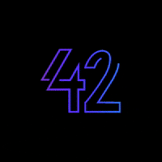

# Lucas Ferronato :man_technologist:

👋 an eternal student and technology enthusiast. I enjoy exploring everything from memory allocation to the end-user value a product delivers.

Currently learning **Zig** and experimenting with new languages and paradigms. I identify primarily as a **Software Engineer**, regardless of job title. I care about the fundamentals and like to understand how all the pieces of a system fit together.

🧠 Although recent roles have been more **front-end** focused, I don’t restrict myself to that universe. I see the challenge of connecting backend, infrastructure, and product as essential and fun. I’ve gravitated toward front-end work because it’s challenging — and I enjoy a good challenge.

🎓 also, I taught programming and Excel for 7 years and love sharing knowledge.

## My journey in stages

- **Stage 5 – Staff/Spec Software Engineer:** technical leadership, platform architecture, mentoring.
- **Stage 4 – Frontend Engineer:** rich interfaces, accessibility, performance, design systems.
- **Stage 3 – Fullstack Developer:** API integration, microservices, user experience.
- **Stage 2 – Data Engineering:** data pipelines, modeling, analytics.
- **Stage 1 – Automation with scripts and MS Stack:** VBA, macros, process automation.

## A little more about me

- **Professor & specialist:** Excel, VBA, Power BI, Azure ADF.
- **DevOps & Infrastructure:** VPC deployments, GitHub Actions, domain/DNS management, SSL, reverse proxy.
- **Interests:** AI, software engineering, business, innovation, education.
- **Hobbies:** code challenges, games, and series.

